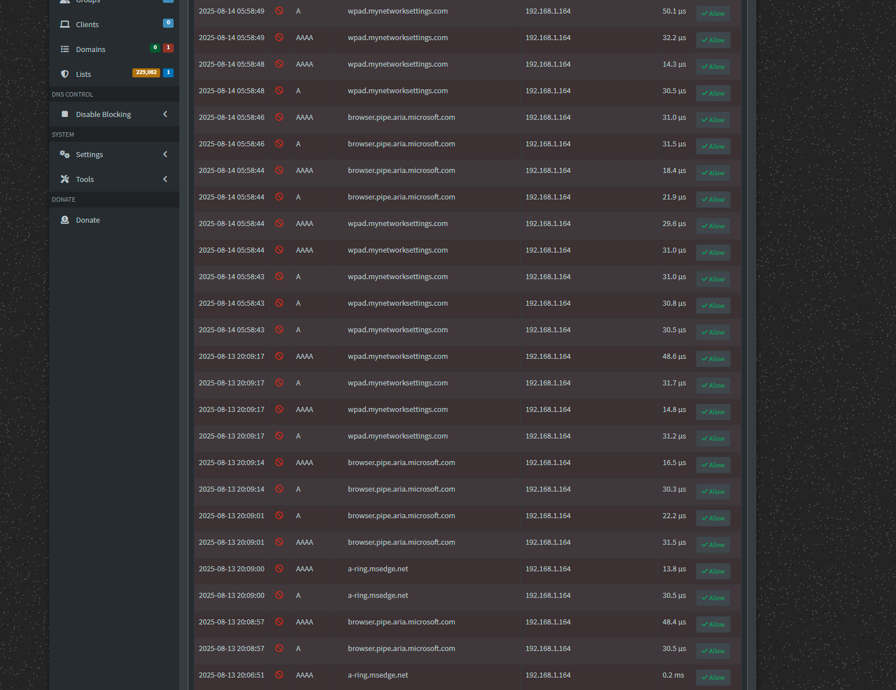

# Pi-hole DNS Lab — Daily Query Export & Quick Analysis

This repo captures a small **DNS monitoring lab** using Pi-hole. It shows how to export **yesterday's queries** from the Pi-hole FTL database, copy them to your workstation, and summarize what you saw.



## What this shows
- Real query traffic (e.g., `wpad.myneworksettings.com`, `browser.pipe.aria.microsoft.com`, `a-ring.msedge.net`) coming from a client `192.168.1.164` as seen in the screenshot.
- Repeatable export pipeline: **FTL (SQLite) → CSV**.
- Quick counts for domains/clients/status codes you can reuse for threat-hunting notes.

> Note: The _status_ codes are Pi-hole internal identifiers. Different values indicate allowed/blocked/cached/etc. Check Pi-hole docs for the exact legend in your version.

---

## Repo Structure

```
pi-hole-dns-lab/
├── README.md
├── artifacts/
│   └── pihole-yesterday.csv        # exported queries (time, client, domain, type, status)
└── images/
    └── pihole-yesterday_screenshot.png
```

---

## How I exported **yesterday** (on the Pi-hole box)

```bash
sudo apt update && sudo apt -y install sqlite3

start=$(date -d 'yesterday 00:00:00' +%s)
end=$(date -d 'today 00:00:00' +%s)

sudo sqlite3 -header -csv /etc/pihole/pihole-FTL.db "
SELECT
  datetime(timestamp,'unixepoch','localtime') AS time,
  client,
  domain,
  type,
  status
FROM queries
WHERE timestamp >= $start AND timestamp < $end
ORDER BY timestamp;
" > ~/pihole-yesterday.csv
```

Then copy to your PC (example on macOS/Linux Terminal):

```bash
scp <user>@<pihole-ip>:~/pihole-yesterday.csv ./pihole-yesterday.csv
```

---

## Quick Analysis Snapshot

**Total rows:** `5225`

### Status code counts
| status_code | count |
|---|---|
| 1 | 278 |
| 2 | 1827 |
| 3 | 1493 |
| 5 | 25 |
| 9 | 94 |
| 12 | 1 |
| 14 | 114 |
| 17 | 1393 |

### Top 10 domains
| domain | count |
|---|---|
| privacy.aurasvc.io | 814 |
| d2y36twrtb17ty.cloudfront.net | 314 |
| status.zybooks.com | 307 |
| wgu.hosted.panopto.com | 248 |
| api.aurasvc.io | 206 |
| wpad.mynetworksettings.com | 170 |
| heapanalytics.com | 106 |
| kv801.prod.do.dsp.mp.microsoft.com | 101 |
| cdn-checkout.joinhoney.com | 96 |
| go-updater.brave.com | 87 |


> Tip: Investigate very noisy clients or suspicious domains (random subdomains, telemetry, ad/tracking, or unusual TLDs).

---


