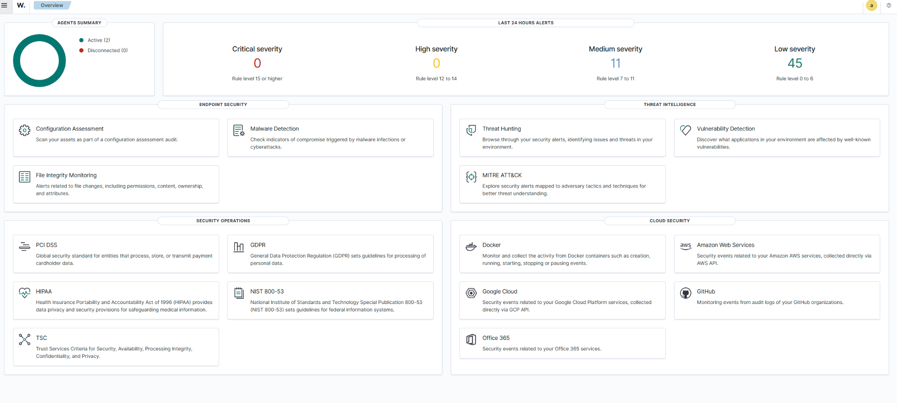
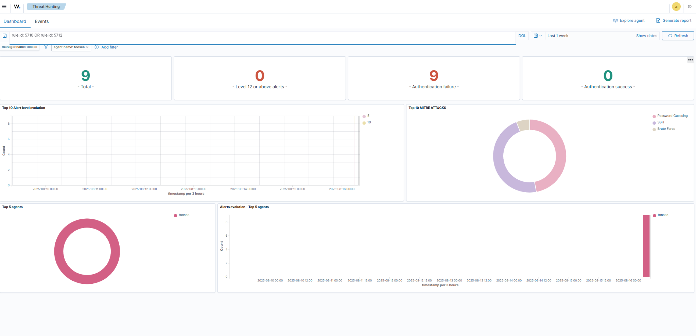
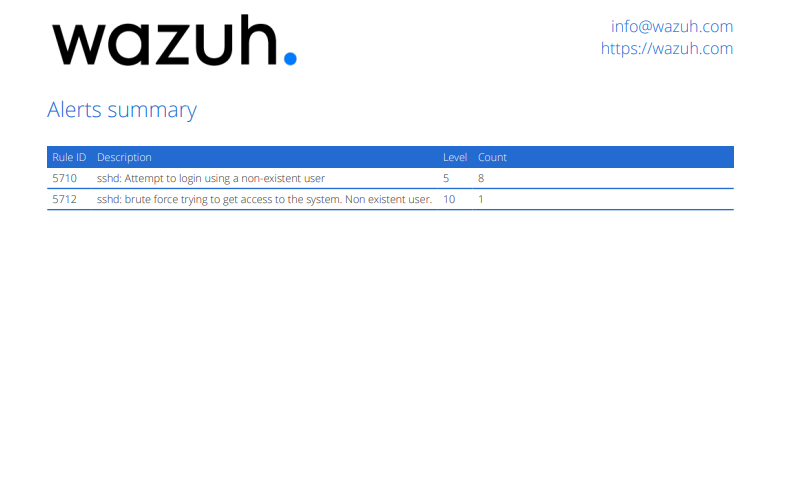
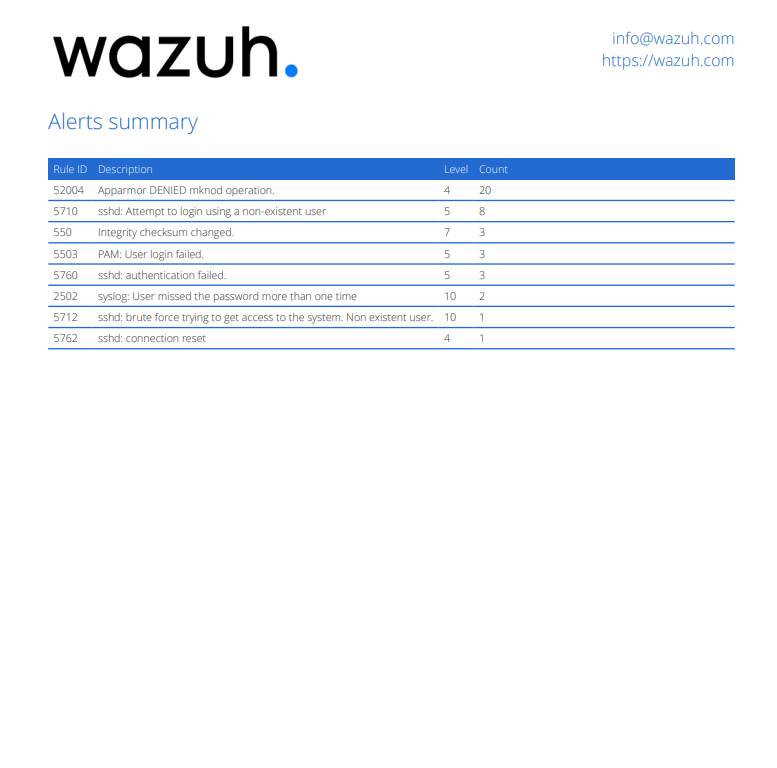

# 🛡️ Wazuh SIEM Lab — Centralized Logging & Alerting

## 🎯 Goal
Collect logs from multiple hosts into a central SIEM and validate detections for brute-force and port-scan activity.

---

## ⚙️ Steps

1) **Provision Wazuh VM**  
   - Specs: 4GB RAM, 2 vCPU, 40GB disk  
   - Install Wazuh (Manager + Dashboard) using the **official documentation path**:
   ```bash
   curl -sO https://packages.wazuh.com/4.7/wazuh-install.sh
   sudo bash wazuh-install.sh --install-all
   ```
   > We first tried the quick `-a` all‑in‑one flag and ran into GPG key and dashboard startup issues. Following the documented flow fixed it.

2) **Onboard Hosts (Agents)**  
   - From the Wazuh dashboard → **Agents** → *Add agent* → copy the registration command shown.  
   - Installed agent on:
     - `docker-host`
     - `pihole`
   - If the agent doesn't show up immediately, restart the service and give it a few minutes.

3) **Trigger Test Events**
   - SSH brute force (simulate failed logins):
   ```bash
   ssh admin@<vm>
   # Enter wrong password 5–10 times
   ```
   - Port scan (Kali or same VM):
   ```bash
   sudo nmap -sS <target-ip>
   ```

---

## 📊 Results

- **2 active agents** sending logs to Wazuh.
- **Alerts detected** across multiple categories:
  - SSH brute force & failed logins (rules `5710`, `5712`, `5760`)
  - Syslog password misses (`2502`)
  - AppArmor denials (`52004`)
  - File Integrity Monitoring checksum changes (`550`)

**Overview Dashboard**  


**Threat Hunting View**  


**Alerts Summary (SSH brute force)**  


**Alerts Summary (full list)**  


---


## ⚠️ Challenges Faced
- Quick installer failed with GPG key and service startup issues.
- Dashboard initially failed to load; required service checks/restarts.
- Agents required troubleshooting (restart & wait for heartbeat).


