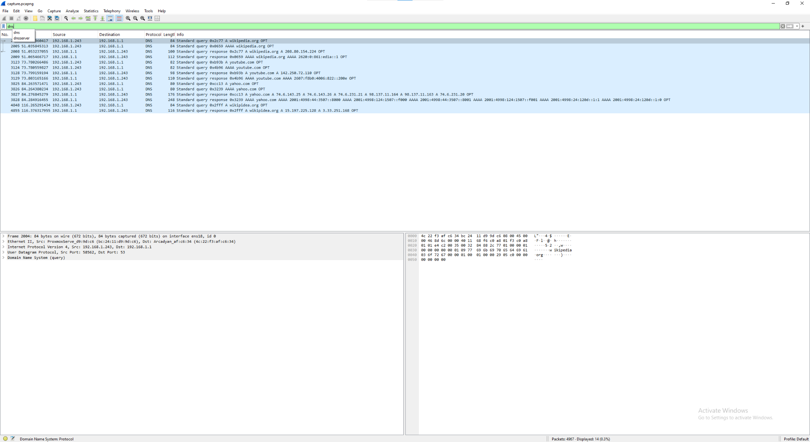

# 🕵️ Wireshark + Traffic Analysis Lab

## Overview
This project demonstrates capturing and analyzing live network traffic using **TShark** (CLI version of Wireshark) on an Ubuntu Server VM and performing analysis in the Wireshark GUI.  
The goal was to identify DNS queries, TCP session establishments, and HTTPS traffic patterns to establish a baseline for normal network activity.

---

## 📌 Environment
- **Capture Host**: Ubuntu Server VM (no GUI)
- **Analysis Host**: Local machine with Wireshark GUI
- **Capture Tool**: `tshark`
- **Interface**: `eth0` (replace if different)
- **Capture Duration**: 120 seconds

---

## ⚙️ Methods
1. Installed TShark and granted non-root capture permissions:
   ```bash
   sudo apt update && sudo apt -y install tshark
   sudo usermod -aG wireshark $USER && newgrp wireshark
   ```
2. Captured traffic:
   ```bash
   tshark -i eth0 -a duration:120 -w ~/capture.pcapng
   ```
3. Generated sample traffic during capture:
   ```bash
   ping -c 5 8.8.8.8
   curl example.com
   curl https://wikipedia.org
   ```
4. Transferred capture to local machine for Wireshark analysis:
   ```bash
   scp <user>@<vm-ip>:~/capture.pcapng .
   ```
5. Applied Wireshark filters:
   - DNS: `dns`
   - TCP SYN: `tcp.flags.syn==1 && tcp.flags.ack==0`
   - HTTPS/TLS: `tls`

---

## 🔍 Findings

**Counts**
- **DNS Queries**: ~6  
- **TCP Connections**: 2  
- **HTTPS Sessions**: 3  

**Details**
- DNS lookups to `wikipedia.org`, `youtube.com`, `yahoo.com`.
- Two TCP connections initiated to port 443 using SYN packets.
- Full TCP 3-way handshakes observed, followed by TLS handshakes.
- TLS sessions contained **Client Hello**, **Server Hello**, and encrypted application data.
- Traffic patterns matched normal browsing and API call behavior.

---

## 📸 Evidence Screenshots

### 1. DNS Queries


### 2. TCP 3-Way Handshake


### 3. HTTPS Session


---

## 📜 Interpretation
- **DNS** queries resolved domain names before connections.
- **TCP** handshakes established secure sessions with remote hosts.
- **TLS** encryption ensured no HTTP payloads were visible.
- This short capture period reflected a baseline of expected user activity.

---

## 🛠️ How to Reproduce
1. Follow the **Methods** section to capture your own traffic.
2. Analyze using Wireshark filters (`dns`, `tcp.flags.syn==1 && tcp.flags.ack==0`, `tls`).
3. Document counts and include screenshots as shown above.

---
